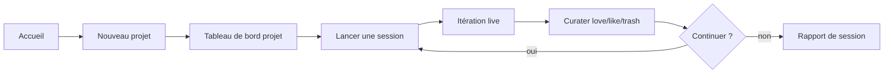

# Manuel d'utilisation — Open Collider Web UI

Interface web pour le moteur de collision sémantique Open Collider. Ce document décrit
l'installation, chaque écran, le mode démo vs live, et la façon de lire les résultats.

**Fork :** [doubianimehdi/open-collider](https://github.com/doubianimehdi/open-collider)  
**Guide rapide intégré :** bouton **guide** dans la barre du haut (en anglais).  
**Ce manuel dans l'app :** bouton **manuel** → `#/manuel`

---

## 1. Installation et lancement

Depuis la racine du dépôt :

```bash
pip install -e .                       # package open_collider
pip install -r webapp/requirements.txt # FastAPI, uvicorn, httpx…
pip install -e ".[api]"                # optionnel — mode live Anthropic / OpenAI
uvicorn webapp.server:app --port 8714
```

Ouvrir **http://localhost:8714**

| Composant | Rôle |
|-----------|------|
| `webapp/server.py` | API REST + fichiers statiques |
| `webapp/orchestrator.py` | Exécution des itérations (démo ou live) |
| `webapp/settings.py` | Clés API et réglages (fichier local gitignored) |
| `projects/<nom>/` | Données du projet (même structure que le CLI) |

---

## 2. Vue d'ensemble du parcours



1. **Créer un projet** — brief + textes de référence (faisceau 1 du collisionneur).
2. **Démarrer une session** — le moteur invente des domaines distants (faisceau 2), produit des collisions, score et filtre.
3. **Curater** — vous jugez les ~12 meilleures idées.
4. **Itérer** — vos ♥ love orientent l'itération suivante (stratégies deepen + refresh).
5. **Clore** — rapport markdown + HTML agrégé.

---

## 3. Écran d'accueil (`#/`)

- **Explication en langage simple** : à quoi sert Open Collider (échapper au « slop » des LLM).
- **Quand l'utiliser / quand l'éviter** : idées ouvertes vs réponses factuelles uniques.
- **Liste des projets** existants sur disque.

Actions : **+ New project**, lien **guide**, lien **settings**.

---

## 4. Créer un projet (`#/new`)

| Champ | Conseil |
|-------|---------|
| **Nom** | Identifiant court (ex. `discover_weekly_redesign`) |
| **Objective** | Une phrase : pour quoi avez-vous besoin d'idées ? |
| **Context** | Contexte produit, marché, contraintes connues |
| **Constraints** | Budget, délais, canaux, interdits business |
| **What makes good ideas** | Critères de qualité *pour vous* |
| **Forbidden topics** | Thèmes que le modèle ne doit pas recycler |
| **Reference texts** | Notes, mémos, brouillons — **plus c'est riche, mieux c'est** |

Chaque texte peut avoir ses propres **forbidden topics**. Ils alimentent le faisceau 1.

---

## 5. Tableau de bord projet (`#/p/<nom>`)

### Barre « Collision chamber »

| Bouton | Effet |
|--------|--------|
| **DEMO** | Simulation instantanée, idées factices étiquetées — **gratuit, sans clé** |
| **LIVE API** | Appels réels au fournisseur configuré dans Settings (~5–15 min, coût API) |
| **Start new session** | Nouvelle session de brainstorm |
| **next iteration** | Relance une itération dans une session existante |
| **report** | Génère et ouvre le rapport de session |

### Sessions passées

Chaque ligne **ITER nn** mène à la curation de cette itération. Le badge indique si vous avez déjà donné votre verdict.

---

## 6. Itération en cours (`#/p/<nom>/run/<id>`)

Phases affichées en direct :

1. **Domains** — génération des domaines distants (YAML).
2. **Collide** — chaque paire texte × domaine produit un lot d'idées brutes ; le bloc **En clair** (français actionnable) est généré **à ce moment** :
   - **Live** : appel LLM par lot d'idées, ancré au brief
   - **Demo** : texte FR déterministe simulé, lié au brief
3. **Score** — le juge note chaque idée sur 5 axes (1–5).
4. **Curate** — sélection des meilleures idées au-dessus du seuil.

Compteurs : domain sets, collisions, idées brutes, idées scorées.

À la fin : redirection automatique vers l'écran de curation.

---

## 7. Curation (`#/p/<nom>/b/<session>/i/<n>`)

### Les trois flags

| Flag | Couleur | Effet sur la suite |
|------|---------|-------------------|
| **♥ love** | rose | Approfondir le domaine source + transférer le mécanisme ailleurs |
| **↑ like** | ambre | Signal positif faible |
| **✕ trash** | neutre | Ignorer ; **non flaggé = trash** dans le rapport final |

### Axes de score (barres sous chaque carte)

| Axe | Question posée au juge |
|-----|------------------------|
| **orig** (originality) | Idée vraiment nouvelle ou conseil rebaptisé ? |
| **resist** (resistance) | Tient-elle face aux objections ? |
| **thesis** (thesis_density) | Une thèse claire et testable ? |
| **ground** (concrete_grounding) | Des faits ou exemples possibles ? |
| **cogn** (cognitive_load) | Fait-elle réfléchir ou s'oublie-t-elle tout de suite ? |

**Note de pilotage** (champ texte) : consigne libre pour la prochaine itération (« plus d'idées sur le timing », etc.).

**Lock in feedback** enregistre flags + note, régénère `ITER_REPORT.md` / `ITER_REPORT.html`, et prépare l'état pour l'itération suivante.

Lien **iteration HTML report ↗** (si disponible) : rapport visuel standalone de cette itération (PR upstream #1).

### Lire une carte idée — **En clair**

Chaque idée affiche un bloc **En clair** en français (à lire **avant** le texte anglais). Il est produit **à la création** de l'idée, pas après coup. Les anciennes itérations **se mettent à jour** automatiquement au premier chargement si la clarté était en version 1.

| Partie | Contenu |
|--------|---------|
| **Titre (headline)** | Une phrase : *quoi tester* pour **votre** brief |
| **Pour votre sujet** | Mécanisme emprunté traduit + lien explicite au produit ou enjeu du brief |
| **À appliquer** | 3 actions concrètes sur le produit (pas de consignes méta du type « écrivez une phrase ») |
| **Cette semaine (≈30 min)** | Un test faisable avec une personne réelle |
| **Texte original** | Formulation anglaise brute (repliable) |
| **Prochaine étape** | Consigne **après** le test (ex. noter une variante plus simple) — **pas** une recopie du test |

**Ligne collision** (sous le titre) : `De T01 + inspiré par …` — le domaine cité **dans le texte de l'idée** est prioritaire sur le nom générique du set de domaines.

**Exemple** (brief Discover Weekly / bulle de goût) :

- *Faire évoluer Discover Weekly avant que l'utilisateur ne voie un changement.*
- Mécanisme fourmis : changements invisibles d'abord, puis effet en surface.
- Actions : signaux d'écoute faibles, micro-variante playlist, mesure à J+7.
- Test : montrer la playlist à quelqu'un — noter s'il voit un changement.

---

## 8. Bilan de session (`#/p/<nom>/b/<session>/synthesis`)

**Bouton ◈ Bilan** sur le tableau de bord projet. La **boussole** (Préparer → Générer → Choisir → Relancer → Bilan) apparaît sur la curation et le bilan.

### Clôturer la session

1. Lire vos **favorites ♥** et le bloc **En clair** de chaque idée.
2. Lire **Prochaine étape** — consigne complémentaire au test de 30 min, pas une recopie.
3. Cocher les idées que vous retenez vraiment.
4. Noter ce que vous ferez ensuite (optionnel).
5. Cliquer **Valider le bilan ✓** — la boussole affiche « Bilan validé », le projet indique **bilan validé**, fichier `synthesis_done.json` enregistré.

### Lire une idée (curation ou bilan)

1. **En clair** — titre + pour votre sujet + 3 actions + test 30 min (voir §7).
2. **Texte original** — formulation exacte de la génération (repliable).
3. **Prochaine étape** — quoi faire *après* le test ou en second lieu.

### Boussole (toutes les vues)

Rappel des 5 étapes : Préparer → Générer → Choisir → Relancer → Bilan.

Chaque carte montre **d'où vient l'idée** (`De T01 + inspiré par …`) sans remonter ailleurs.

Fichiers sur disque :

```text
projects/<nom>/brainstorms/<session_id>/
├── REPORT.md          # agrégé toutes itérations
├── REPORT.html        # même contenu, mise en page navigateur
├── iter_001/
│   ├── curated_ideas.json
│   ├── flags.json
│   ├── ITER_REPORT.md
│   └── ITER_REPORT.html
└── iter_002/ …
```

---

## 9. Réglages (`#/settings`)

Stockage local : `webapp/settings.json` (gitignored). La clé Anthropic est aussi recopiée dans `.env` à la racine pour le workflow Claude Code.

### Fournisseurs

| Provider | Usage |
|----------|--------|
| **Demo only** | Aucune clé ; pipeline simulé |
| **Anthropic** | Claude — référence du moteur ; `pip install -e ".[api]"` |
| **OpenAI-compatible** | OpenAI, OpenRouter, Groq, Mistral, Ollama, LM Studio… |

Pour OpenAI-compatible : **Base URL** + **API key** (vide pour Ollama local).

### Modèles (optionnel)

| Stage | Rôle |
|-------|------|
| Domain model | Invente les champs distants — modèle créatif |
| Generation model | Produit les idées en masse — modèle rapide |
| Scoring model | Juge strict au format tableau |

Laisser vide = défauts du fournisseur.

### Pipeline avancé

- **Score threshold** — seuil de rétention (défaut ~3.5).
- **Collisions per round** — paires texte×domaine par stratégie.
- **Max parallel** — appels LLM simultanés (live).

**Test connection** — vérifie clé + URL sans lancer une session complète.

---

## 10. Mode démo vs mode live

| | Demo | Live |
|---|------|------|
| Clé API | Non | Oui (Settings) |
| Durée | Quelques secondes | 5–15 min |
| Coût | 0 | Selon provider |
| Idées | Placeholders étiquetés + **En clair FR simulé** | Réelles + **En clair FR via LLM** |
| Structure disque | Identique | Identique |

Le pill en haut à droite indique `demo` ou `live: anthropic` / `live: openai`.

---

## 11. Compatibilité CLI / Claude Code

Les projets créés dans la Web UI sont **interchangeables** avec :

- `/collider_setup` et `/brainstorm` dans Claude Code
- Skills Codex `$open-collider-setup` / `$open-collider-brainstorm`
- Scripts Python API mode (`open_collider.brainstorm`)

Le choix **demo/live** dans la Web UI est **par session**, indépendant du `llm_provider` du `project_config.yaml` (utilisé surtout en CLI).

---

## 12. Dépannage

| Problème | Piste |
|----------|-------|
| LIVE API grisé | Ouvrir Settings, choisir un provider, saisir une clé, **Save**, **Test connection** |
| Run bloqué « already in progress » | Une itération tourne déjà ; attendre ou redémarrer uvicorn |
| Idées démo partout | Passer en LIVE ou configurer Settings |
| Erreur Anthropic | `pip install -e ".[api]"` + clé valide |
| Ollama local | Base URL `http://localhost:11434/v1`, clé vide, modèles compatibles chat |
| Port occupé | `uvicorn webapp.server:app --port 8715` |

---

## 13. Résumé des changements intégrés (fork)

Voir aussi [`CHANGELOG-FORK.md`](../CHANGELOG-FORK.md) à la racine.

| Source | Contenu |
|--------|---------|
| **Clarté actionnable v2** (juin 2026) | Bloc **En clair** à la génération (`clarity_llm.py`, `idea_clarity.py`), boussole, bilan validable, collision domaine du texte, tests `test_clarity_llm.py` |
| **Web UI** (PR #1 fork) | Interface complète, guide, manuel FR, settings, UX débutant |
| **Upstream PR #1** | Rapports HTML `REPORT.html` / `ITER_REPORT.html` |
| **Upstream PR #2** | Multi-provider API (Anthropic, OpenAI, Codex), skills Codex |
| **Upstream PR #3** | Dépendances PDF/reMarkable (`pymupdf`, `reportlab`, `rmscene`) |

Les PR #1–#3 upstream restent **ouvertes** sur `CL-ML/open-collider` ; leur contenu est **déjà fusionné** sur la branche `main` de ce fork.

---

## 14. Raccourcis navigation (hash routes)

| URL | Page |
|-----|------|
| `#/` | Accueil |
| `#/guide` | Guide intégré (EN) |
| `#/manuel` | Manuel utilisateur (FR — ce document) |
| `#/settings` | Réglages |
| `#/new` | Nouveau projet |
| `#/p/<nom>` | Projet |
| `#/p/<nom>/run/<id>` | Itération en cours |
| `#/p/<nom>/b/<session>/i/<n>` | Curation |
| `#/p/<nom>/b/<session>/synthesis` | Bilan de session |
| `#/p/<nom>/b/<session>/report` | Rapport session |

---

*Open Collider — bisociation at scale. Méthode de Cédric Lion / Oparine.*
